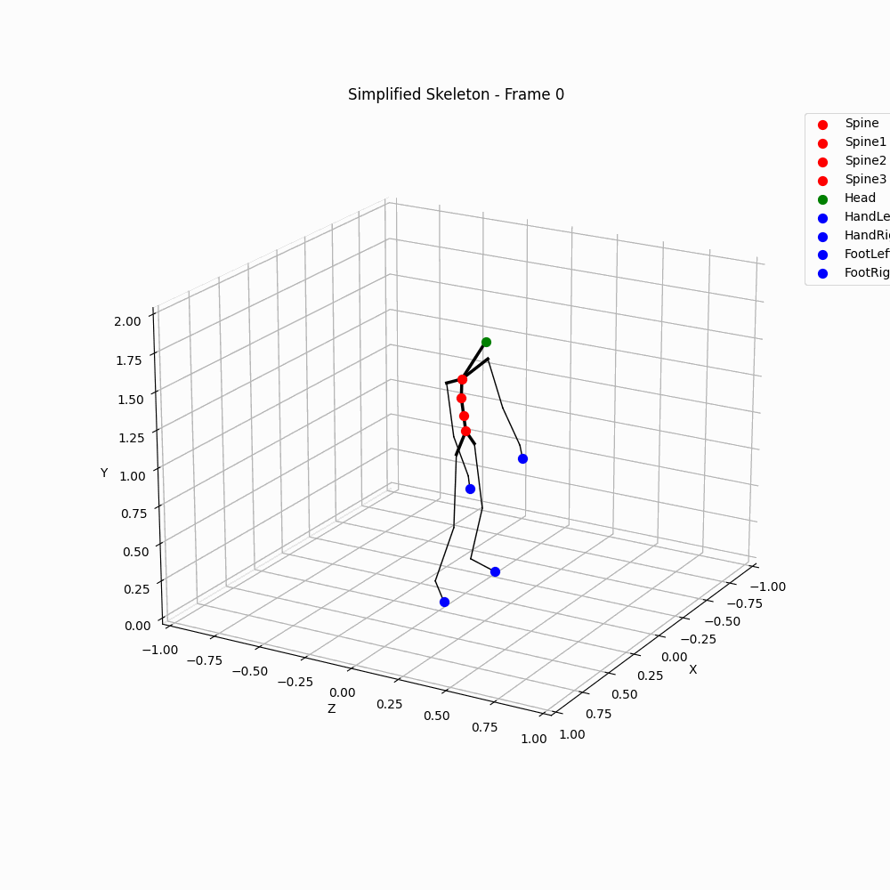

spine-estimation
==============================

<center>
<h2>Spine estimation with NNs</h2>
</center>

<center>

</center>

<p>
<p>
This repository is a project for estimating the spine joints of a human body given the 3D coordinates of the joints of the rest of the body.

Initially it is performed an EDA of the data, to understand the distribution of the data and the correlation between the features.
Then, it is performed a feature engineering, to create new features that can help the model to learn better.
Finally, it is performed a model selection, and hyperparameter tuning, to find the best model for this problem.

The report can be found under the folder [reports](reports).

There are 3 reports:
- [EDA](reports/1.report-EDA.md)
- [Models](reports/2.report-models.md)
- [System pipeline](reports/3.report-pipeline.md)


## Quick Start

### Installation

1. Clone the repository

2. Install the requirements

OR

Make sure that you have installed `Docker` and `make`.

and run the following:

### Usage

1. From the root of the repository, run the following command to build the docker image:

```bash
make build
```

2. Run the following command to run a hyperparameter tuning:

```bash
make run-baseline
```

3. You can run the following command to see the results of the hyperparameter tuning on `MLFlow`:

```bash
make mlflow
```

4. You can run hyperparameter tuning with different models, by changing `make` command:

```bash
make run-baseline
make run-mlp
make run-rnn
make run-lstm
```

5. You can run a jupyter notebook with the following command:

```bash
make jupyter
```
Which will open a jupyter notebook in the `notebooks` folder.