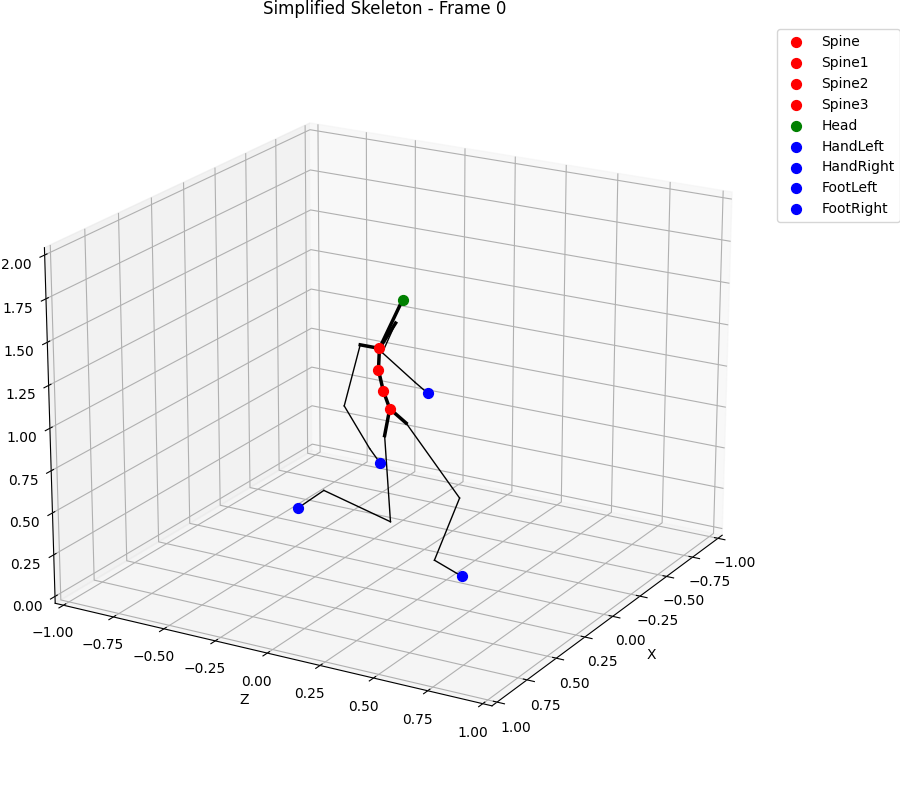
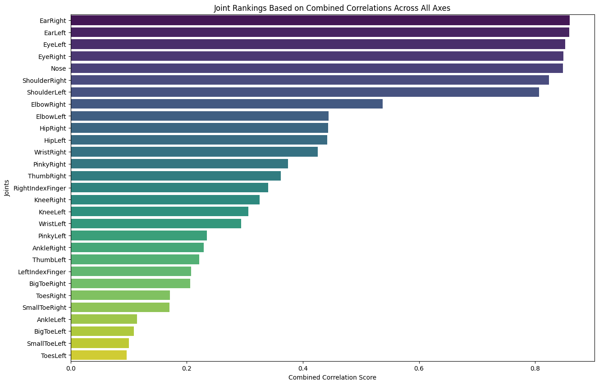
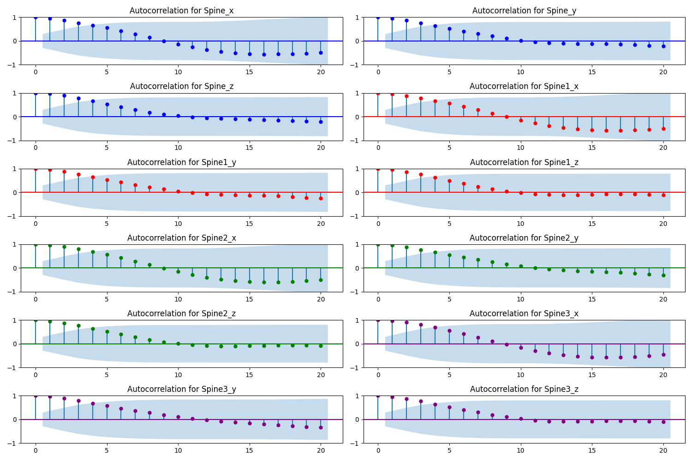
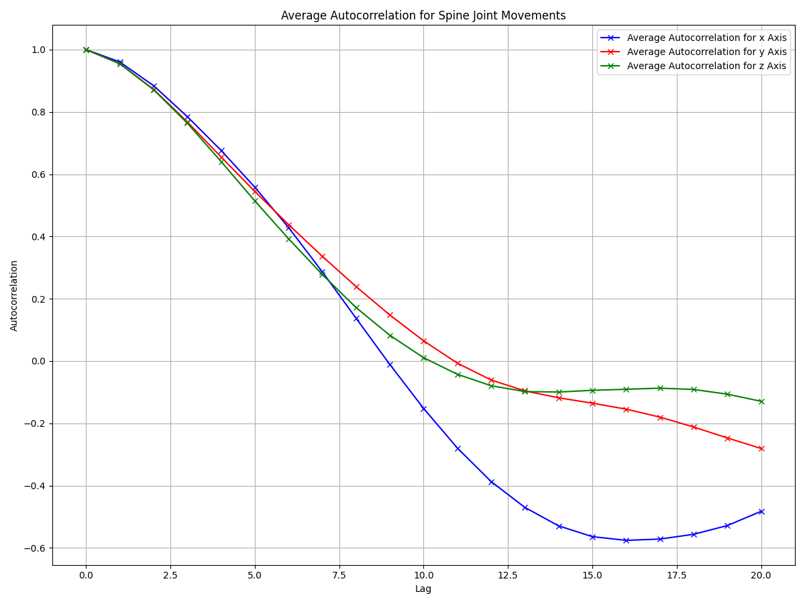

# Spine Joints prediction

## Introduction

This report is a summary of the work done during the project. The task at hand, is to address the missing spine data in the player movement models, and accurately predict them from the rest joints of the human body.

## Data

The data provided for the project is a set of 3D coordinates of the joints of the human body, for a set of players. The data is provided in the form of a CSV file, with each row representing a frame of the player's movement, and each column representing a joint of the human body. Each joint column stores the 3D coordinates of the joint in the form of (x, y, z) coordinates. The data is provided for 17 joints, and the joints are named as follows:
| # | Body Part       |
|-------------|-----------------|
| 1           | Nose            |
| 2           | EyeLeft         |
| 3           | EyeRight        |
| 4           | EarLeft         |
| 5           | EarRight        |
| 6           | ShoulderLeft    |
| 7           | ShoulderRight   |
| 8           | ElbowLeft       |
| 9           | ElbowRight      |
| 10          | WristLeft       |
| 11          | WristRight      |
| 12          | HipLeft         |
| 13          | HipRight        |
| 14          | KneeLeft        |
| 15          | KneeRight       |
| 16          | AnkleLeft       |
| 17          | AnkleRight      |
| 18          | ToesLeft        |
| 19          | ToesRight       |
| 20          | Spine           |
| 21          | Spine1          |
| 22          | Spine2          |
| 23          | Spine3          |
| 24          | LeftIndexFinger |
| 25          | ThumbLeft       |
| 26          | PinkyLeft       |
| 27          | RightIndexFinger|
| 28          | ThumbRight      |
| 29          | PinkyRight      |
| 30          | BigToeLeft      |
| 31          | SmallToeLeft    |
| 32          | BigToeRight     |
| 33          | SmallToeRight   |
| 34          | PlayerPosition  |

The XYZ coordinates of the joints are the real world coordinates of each joint. The last coordinate though is the player position, which is the position of the player in the field. Considering that the frame of reference for our task is the player, we can use this coordinate to transform the rest of the coordinates to the player's frame of reference.

## Visualization

In order to get a better understanding of the data provided, we can visualize the data. Under the `spine.visualization.visualize` we can find some helper components in order to visualize the data. Below we can see a sample visualization of the data for a single player.

Note that for simplicity, the head, hands and feet joints are averaged to a single point.
Morevoer, to better understand the temporal aspect of the data, below there is a sample gif of a randomly selected file.

## Sanity Check

To ensure the integrity and correctness of the data, a sanity check was performed. The check ensures that all the joints exist in every file, as well as that all the cells contain valid values and are in the expected format (XYZ).

For more information on the sanity check, please refer to the `spine.data.utils` module.

## Exploratory Data Analysis

After visualizing the data, and thus getting a basic understanding of the nature of the data provided, we can perform some exploratory data analysis. The goal of the analysis is to get a better understanding of the data, that will help us to formulate a solution to the problem at hand.

### Spatial Analysis

#### Hypothesis Formulation

The first step of the analysis is to formulate a hypothesis. The hypothesis is a statement that we believe to be true, and we will try to prove it.

Considering the mechanics of the human body, we can assume that the spine joints are not independent of the rest of the joints. In other words, we can assume that the spine joints are dependent on the rest of the joints. This means that we can use the rest of the joints to predict the spine joints. However, we further assume that the spine joints are not dependent to the same degree on all the joints. In other words, we can assume that the spine joints are dependent on some joints more than others. This means that -potentially- a subset of the joints of the human body may be more informative than the rest of the joints. Conversely, some joints may introduce noise to the prediction of the spine joints, which in turn may lead to a worse prediction. Thus, the aim of the analysis is to find the subset of joints that are more informative for the prediction of the spine joints.

#### Correlation

The first step of the analysis is to find the correlation between the spine joints and the rest of the joints. The correlation is a measure of the linear relationship between two variables. The correlation coefficient is a value between -1 and 1, where 1 indicates a perfect positive linear relationship, -1 indicates a perfect negative linear relationship, and 0 indicates no linear relationship. The correlation coefficient is calculated using the Pearson correlation coefficient.

Considering the number of animation data we have available, and that the monitored subject depicted in the data performs a various range of movements, we can assume that the data is representative of the general case. Therefore, we need to take into account all of them and generate a single correlation coefficient for each joint, wrt the spine joints. Thus, we iterate over all the files, and for each file we calculate the correlation coefficient between the spine joints and the rest of the joints for each axis (X, Y, Z). Then, we average the correlation coefficients for each joint, and we get a single correlation coefficient for each joint.

In order to visualize the correlation in a single figure and get a more interpretable view, the mean per-axis correlation coefficients have been averaged to a single value. The results are shown in the figure below.

    

        <h4>Correlation Coefficients for each joint</h4>
        
    

#### Hypothesis Validation

The results of the correlation analysis validate the initial hypothesis. As we can see from the figure above, the spine joints are highly correlated with the rest of the joints. Moreover, the correlation coefficients are not equal for all the joints. This means that some joints are more informative than others. Thus, we can use the joints with the highest correlation coefficients to predict the spine joints. Unsprisingly, the joints with the highest correlation coefficients are the joints that are closer to the spine joints, such as the shoulders, the hips, the head, etc. and less the joints that are further away from the spine joints, such as the feet, the ankles, etc.

### Temporal Analysis

The next step of the analysis is to perform a temporal analysis of the data. The goal of the analysis is to understand whether the spine posture is dependent on the previous time stamp and thus whether we can use the previous frames to predict the spine joints.

#### Hypothesis Formulation

Similarly to the spatial analysis, we can formulate a hypothesis for the temporal analysis. The hypothesis is that the spine joints are dependent on the previous frames. In other words, we can assume that the spine joints are dependent on the previous frames, and thus we can use the previous frames to predict the spine joints. Although we now practically that this is true, we need to quantify the degree of dependency, in order to understand how many previous frames we can use to predict the spine joints.

#### Auto-correlation

The first step of the analysis is to find the auto-correlation of the spine joints. The auto-correlation is a metric that quantifies the degree of dependency of a variable on its previous values. The auto-correlation is a value between -1 and 1, where 1 indicates a perfect positive linear relationship, -1 indicates a perfect negative linear relationship, and 0 indicates no linear relationship. In that way, we can quantify the degree of dependency of the spine joints on the previous frames.

We have 4 spine joints, and thus we need to calculate the auto-correlation for each joint, on each axis (X, Y, Z). By randomly selecting a file, and calculating the auto-correlation for each joint, we get the following results:

    

        <h4>Auto-correlation of the spine joints</h4>
        
    

We selected a lag of 20 frames since this is the maximum allowed number of frames we can use. As we can see from the figure above, the auto-correlation is high for all the joints, and thus we can assume that the spine joints are dependent on the previous frames. Howevef, one can notice that coefficient decreases considerbly for time lags that are close to the window size (20 frames). This means that a smaller window size may be more appropriate for the prediction of the spine joints.

Nonetheless, we still need to figure out a way to combine the auto-correlation of the 4 spine joints, in order to get a single value that quantifies the degree of dependency of the spine joints on the previous frames. In order to do that, we can average the auto-correlation of the 4 spine joints, and get a single value that quantifies the degree of dependency of the spine joints on the previous frames. The results are shown in the figure below.

    

        <h4>Average auto-correlation of the spine joints</h4>
        

For this instance, it seems that close to lag 10, the auto-correlation is close to 0, which means that there is no linear relationship between the spine joints and the previous frames, and after the 10th frame, the auto-correlation is negative, which means that there is a negative linear relationship between the spine joints and the previous frames, which probably indicates that there is a periodicity in the data.

Finally we can calculate the average auto-correlation for all the files, and get a single value that quantifies the degree of dependency of the spine joints on the previous frames. The results are shown in the figure below.

    

        <h4>Average auto-correlation of the spine joints for the whole dataset</h4>
        

It seems that by averaging every file, the window size that the correlation if above 0 is smaller than the previous example. Indicatively, we can see that the correlation is above 0 for a window size of ~6 for Y axis, ~8 for X axis and ~10 for Z axis. It is likely that if we use some sort of auto-regressive model, we should use a window smaller than 10 frames, and likely around the smaller window size of the 3 axes, which is 6 frames.

Optinally, we could delve deeper into the temporal analysis and calculate the correlation coefficient for each joint, wrt the spine joints, for each time lag.

