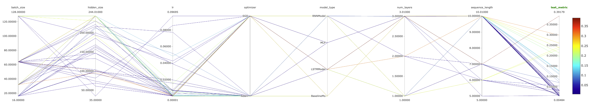

## Problem formulation

The problem at hand is to predict the X,Y,Z coordinates of the four spine joints, given the joints' coordinates of the rest of the body. The problem is formulated as a regression problem, where the input is the 3D coordinates of the joints of the rest of the body, and the output is the 3D coordinates of the spine joints.

Acording to the EDA performed earlier, it is expected that the model will be able to predict the spine joints with a high accuracy, since the joints are highly correlated with the rest of the body joints. Moreover, if the hypothesis is correct, the model will be able to predict the spine joints by providing the joints of the upper body only, since the upper body joints are highly correlated with the spine joints. More specifically, the joints that will be used as input are the following:

- Right shoulder
- Left shoulder
- Right elbow
- Left elbow
- Right hip
- Left hip
- Left eye
- Right eye
- Left ear
- Right ear
- Nose

Considering the structural dependencies of the joints of the head, keeping them separatly as input feature might be redundant. Therefore, will be averaged and used as a single feature. Considering the volume of the data, it would be better to keep a balanced number of features to avoid any potential overfitting.

## Preprocessing

The raw data contain the 3D coordinates of the joints of the body with reference to a point in the space. That means that it is included the translation of the body in the space. Since we are interested in the relative position of the joints, the translation of the body is removed from the data. The translation is removed by subtracting the coordinates of the root joint from the coordinates of the rest of the joints. Therefore it is assumed that the velocity of the body in space is irrelevant to the prediction of the spine joints. However, the angular velocity of the joints of interest could be proved benefecial to the prediction, but it is not investigated in this project.

Finally, the data are normalized by applying the min-max normalization. In the realm of machine learning, it is common practice to normalize the data before feeding them to the model. The reasons are:
- Improves convergence speed, because the optimization algorithm will converge faster in a normalized space.
- Prevents the model from being biased towards features with higher magnitude.
- Improves the numerical stability of the model. In particular, can prevent the saturation of the features with certain activation functions.

The normalization is performed by applying the following formula to each feature:

$$x_{norm} = \frac{x - x_{min}}{x_{max} - x_{min}}$$

The min-max normalization is a linear transformation, which means that the distribution of the data is preserved.

## Model selection

To select the best performing model, it is wise to try a variety of models and compare their performance. The models that will be used are the following:
- Linear regression. A simple linear model that is used as a baseline.
- MLP. A simple MLP with two linear layers.
- RNN. A simple RNN that will be investigated for the best performing sequence length, hidden size and number of layers.
- LSTM. A simple LSTM that will be investigated for the best performing sequence length, hidden size and number of layers.

According to the EDA it is expected that the autoregressive models will perform better over the linear model, since the joints are highly correlated with each other over time. Moreover, it is expected that the LSTM will perform better than the RNN, since the LSTM is able to capture long term dependencies better than the RNN.

## Experimental setup

There are two kinds of datasets that will be used for the experiments. The first one is the `StaticSkeleton`, which contains the 3D coordinates of the joints of the body at a specific time, and generates pairs of input and output data.

The second one is `SequentialSkeletonDataset` which generates sequences of input data of a predifined length and the corresponding output data of the last frame of the sequence. The length of the sequence is a hyperparameter that will be investigated for the best performing value. Although it is expected according to the EDA that a frame length of ~6 will be sufficient, it is wise to investigate the performance of the model for different frame lengths.

The dataset is split into train, validation and test sets, under the rule of 70-20-10. The train set is used to train the model, the validation set is used to tune the hyperparameters of the model, and the test set is used to evaluate the performance of the model on unseen data. The test set is used only once, after the model is trained and tuned, to avoid any bias towards the test set.

The loss function that will be used is the Mean Squared Error (MSE), which is defined as:

$$MSE = \frac{1}{n}\sum_{i=1}^{n}(y_i - \hat{y_i})^2$$

where $y_i$ is the ground truth value and $\hat{y_i}$ is the predicted value. The MSE is a common loss function for regression problems, and it is used to measure the distance between the predicted and the ground truth values. The MSE is used as a loss function because it is differentiable, which is a requirement for the backpropagation algorithm.

As a metric to evaluate the performance of the model, the Mean Absolute Error (MAE) is used. The MAE is defined as:

$$MAE = \frac{1}{n}\sum_{i=1}^{n}|y_i - \hat{y_i}|$$

The MAE is a common metric for regression problems, and it is used to measure the average magnitude of the errors in a set of predictions. The MAE is used as a metric because it is more interpretable than the MSE, since it is measured in the same units as the data.

The models will be trained for 30 epochs and a hyperparameter search will be performed for each model. The hyperparameters that will be investigated are the following:
- Sequence length. The length of the sequence that will be fed to the model.
- Hidden size. The number of hidden units in the RNN and LSTM layers.
- Number of layers. The number of layers in the RNN and LSTM models.
- Learning rate. The learning rate of the optimizer.
- Batch size. The number of samples that will be fed to the model at once.
- Optimizer. The optimizer that will be used to train the model.

The total number of trials per model type will be 10.

## Model pros and cons

- Linear regression
    - Pros
        - Simple model
        - Fast training
        - Easy to interpret
    - Cons
        - Cannot capture non-linear relationships
        - Cannot capture temporal dependencies

- MLP
    - Pros
        - Simple model
        - Fast training
        - Easy to interpret
    - Cons
        - Cannot capture temporal dependencies

- RNN
    - Pros
        - Can capture temporal dependencies
        - Can capture non-linear relationships
    - Cons
        - Slow training
        - Hard to interpret
         Computationally more expensive than MLP

- LSTM
    - Pros
        - Can capture temporal dependencies
        - Can capture non-linear relationships
    - Cons
        - Slow training
        - Hard to interpret
        - More complex than RNN
        - Computationally more expensive than RNN

## LSTM in a nutshell

The LSTM is a type of RNN that is able to capture long term dependencies better than the RNN. The LSTM is able to do that by using a memory cell that is able to store information for long periods of time. The memory cell is able to store information by using gates that control the flow of information in and out of the cell. The gates are implemented as neural networks, and they are trained along with the rest of the model. The gates are the following:
- Forget Gate: Determines which information from the cell state is to be retained or discarded. It examines the previous output and the current input, producing a value between 0 (completely forget) and 1 (completely retain) for each component of the cell state.
- Input gate. Controls the flow of information from the input to the current cell state.
- Output gate. Defines the next hidden state or the LSTM block's output. It bases its decision on the current input, the previous hidden state, and the current cell state.

The LSTM is able to capture long term dependencies by using the forget gate to decide what information to keep in the cell state, and the input gate to decide what information to add to the cell state. The output gate is used to decide what information to output from the cell state.

## Results

Below are presented the results of the experiments. The results are presented in the form of a parallel coordinates plot.

As expected the best performing model is an LSTM of a single layer with a hidden size of 162. The best performing sequence length is 10. The best performing optimizer is the Adam optimizer with a learning rate of 0.0037. The best performing batch size is 16.

The best performing model is evaluated on the test set and the result is `0.005 MAE`. The result is very good, considering that the range of the data is between 0 and 1. The result is also very good considering that the model is trained on a small dataset of ~1000 samples.