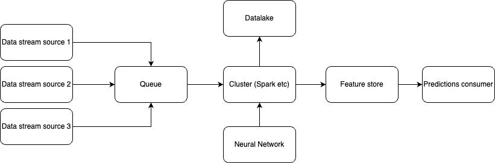

## Pipeline

To deploy the model during a 90-minute-long soccer match with a continuous stream of frames that contains 22 players each, it is required to have a pipeline that is able to process the frames in real-time. The pipeline is responsible for the following tasks:

- Ingesting the frames from the video stream/features from the detections provider.
- Preprocessing the frames/features.
- Feeding the frames/features to the model.
- Postprocessing the model's output.
- Sending the output for visualization/storage.

Due to the real-time requirements of the pipeline and the streaming nature of the incoming data, the system would be more efficient if it was implemented in a streaming fashion. This means that the pipeline would be implemented as a series of stages that are connected to each other, and each stage would be responsible for a specific task. The stages would be connected to each other through a queue, and the data would be passed from one stage to the next through the queue. This way, the pipeline would be able to process the data in real-time, since each stage would be able to process the data as soon as it is available.

A high-level overview of the pipeline is shown in the following figure:

The pipeline consists of the following stages:
- Data streaming sources: Multiple sources of data that could be different players, different cameras, different features from the detections provider, or different providers.

- Queue: A queue that stores the data that are produced by the data streaming sources. The queue is used to decouple the data streaming sources from the rest of the pipeline, so that the data streaming sources can produce data at their own pace, and the rest of the pipeline can process the data at its own pace. This way, the pipeline can process the data in real-time, since the data streaming sources can produce data as soon as they are available, and the rest of the pipeline can process the data as soon as they are available.

- Cluster: A cluster of workers that are responsible for processing the data. The cluster is used to parallelize the processing of the data, so that the data can be processed faster. The cluster is also used to distribute the processing of the data across multiple machines, so that the data can be processed faster. The processing of the data includes the preprocessing, the inference, and the postprocessing of the data.

- Feature store: A feature store that stores the features that are produced by the cluster. The feature store is used to decouple the cluster from the rest of the pipeline. From the feature store, the features can be consumed by multiple consumers, and the features can be consumed at their own pace.

- Datalake: A datalake that stores the features that are produced by the cluster. The datalake is used to store the data that are produced by the cluster for future use, such as training a model, evaluation of the historical data, or visualization of the historical data etc.